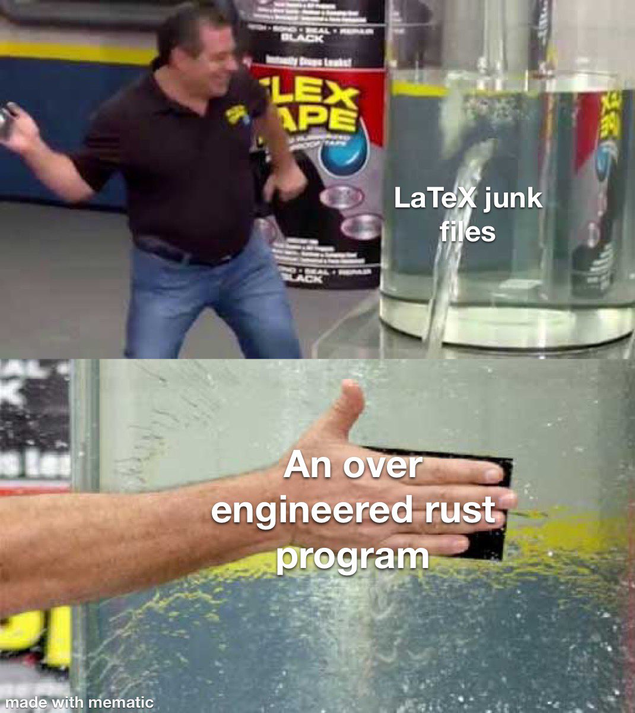

# $\LaTeX$ cleaner

This is a very simple project designed to recursively clean up directories with lots of $\LaTeX$ files.



It looks for and removes `aux`, `log` and `gz` files.
It looks for and optionally compiles `tex` files.

## Examples:
```sh
latex_cleaner # clean all files in current dir
```

```sh
latex_cleaner ../ u # clean all files in parent dir, and recompile tex files
```
